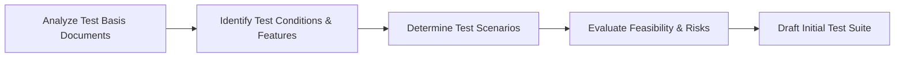

# 🔍 What is Test Analysis (Test Basis)?

## Overview
**Test Analysis** is the phase in the software testing lifecycle where the **Test Basis** is analyzed to identify testable features, define test conditions, and establish initial test scenarios.

---

## 📖 What is a Test Basis?
The **Test Basis** is defined as all sources of information from which the requirements of a component or system are derived. It serves as the foundation for designing all test cases.

### Common Examples of Test Basis:
* System Requirement Specifications (SRS)
* Business Requirement Specifications (BRS)
* Use Cases & User Stories
* Architecture & Technical Design Documents
* Existing Application Code (for maintenance testing)
* Regulatory Standards & Industry Compliance Guides

---

## 🛠️ The Test Analysis Process

1. **Document Review:** Thoroughly analyze specifications to resolve ambiguities early.
2. **Identify Test Conditions:** Determine high-level aspects that can be verified (e.g., performance, security, functional features).
3. **Define Scenarios:** Convert identified test conditions into clear test scenarios.
4. **Feasibility Analysis:** Determine if requirements are measurable and testable.
