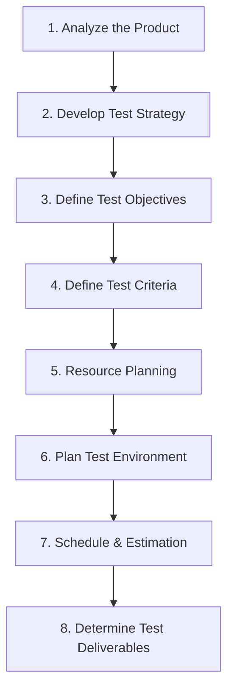

# 📋 How to Create a Test Plan

## Overview
A **Test Plan** is a comprehensive document that outlines the strategy, objectives, scope, schedule, deliverables, and resources needed to execute software testing activities.

---

## 🛠️ 8 Steps to Create a Test Plan

1. **Analyze the Product:** Review system documentation and understand user workflows.
2. **Develop Test Strategy:** Define testing scope, levels (Unit, Integration, System, Acceptance), and types (Functional, Performance, Security).
3. **Define Test Objectives:** Outline target features to test and success criteria.
4. **Define Test Criteria:** Specify **Suspension Criteria** (when to pause testing) and **Exit Criteria** (when to conclude testing).
5. **Resource Planning:** Assign QA roles, responsibilities, and hardware/software assets.
6. **Plan Test Environment:** Configure necessary OS, browsers, databases, and network setups.
7. **Schedule & Estimation:** Establish timelines, milestones, and effort allocations.
8. **Determine Test Deliverables:** List all documents to produce (Test Cases, RTM, Defect Reports, Summary Reports).
